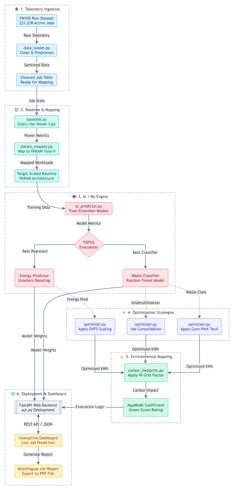

<div align="center">


*"The greenest supercomputer is not the one built with the newest silicon, <br/>but the one that wastes the least of what it already has."*

[](https://git.io/typing-svg)


[](https://python.org)
[](https://fastapi.tiangolo.com)
[](https://docker.com)
[](LICENSE)

Supercomputers waste electricity every second. Not because they're doing too much— but because they're doing too little with what they've been given. AlpaRodh identifies and eliminates this hidden waste using AI, before it happens.

</div>

---

## ⚡ The Problem: Invisible Electricity Waste

Every job running on a supercomputer is allocated a set of CPU cores. But when a job only *uses* 10 cores out of 32 it was given, the remaining 22 cores sit **idle — yet still draw power**. This is **Variable Resistance** — the dynamic friction between what's allocated and what's actually needed.

```
Job Request:  ████████████████░░░░░░░░░░░░░░░░  (10 of 32 cores used)
                               ^^^^^^^^^^^^^^^
                               THIS power is wasted — AlpaRodh targets this
```

At India's PARAM Yuva-II scale, this waste costs **kilowatt-hours of electricity and kilograms of CO₂** every day — on a grid that's **3.13× more carbon-intensive** than the European systems where most HPC research originates.

---

## 🌏 India-Specific Context

Most HPC research uses European datasets on low-carbon grids. AlpaRodh specifically addresses the **India gap**:

```
Italy grid:  230 gCO₂/kWh  ████████████░░░░░░░░░░░░░░░░░░░░░░░░░░░░
India grid:  720 gCO₂/kWh  ████████████████████████████████████████
                                                                  ↑
                             3.13× more carbon-intensive
                             Every kWh saved in India prevents 3.13× more pollution
```

AlpaRodh uses PM100 (Marconi100, CINECA Italy) as a scientifically valid analogue for PARAM Yuva-II (CDAC Pune) — both are hybrid CPU-GPU clusters with similar architectural profiles — while applying **India's actual grid carbon factor** for all environmental calculations.

<div align="center">
  
### PARAM Yuva-II — Target System (CDAC Pune)

| Component | CPU Nodes | GPU Nodes |
|-----------|-----------|-----------|
| **CPU** | Intel Xeon E5-2670 (8-core) | Intel Xeon E5-2650 (8-core) |
| **GPU** | — | NVIDIA Tesla M2090 |
| **Node Count** | 340 | 36 |
| **Grid CO₂** | 720 gCO₂/kWh | (India grid factor) |

</div>

---

## 🏗️ System Architecture

<div align="center">
  
</div>

---

## 🗃️ Dataset & Feature Engineering

AlpaRodh uses machine learning to predict energy waste in High-Performance Computing (HPC) jobs using the PM100 (Marconi100) telemetry dataset from CINECA, Italy. The dataset contains ~231K job records with tabular features:
- **Power:** `node_power_consumption`, `cpu_power_consumption`, `mem_power_consumption`
- **Allocation:** `num_cores_req` (requested), `num_cores_alloc` (allocated), `num_gpus_alloc`
- **Execution:** `run_time`

Dataset Link: https://zenodo.org/records/10127767

> [!WARNING]
> **Data Leakage Prevention:** To prevent the Waste Classifier from simply doing basic math (`alloc > req`) and achieving a trivial 100% accuracy, we strictly masked all core allocation data.

**Engineered Feature Sets:**
- **Waste Classifier (Restricted):** <br>
  `node_pwr_w`, `cpu_pwr_w`, `mem_pwr_w`, `cpu_to_node_ratio`, `mem_to_cpu_ratio`, `power_per_core`, `run_time`, `log_run_time`, `num_gpus_alloc`.
- **Energy Regressor (Full Access):** <br>
  Uses all classifier features, plus `num_cores_req`, `num_cores_alloc`, `core_mismatch`, and `mismatch_ratio` to accurately forecast total dynamic `energy_wh`.

---

## 🧠 Predictive Modeling using Machine Learning

AlpaRodh trains and rigorously compares 6 regressors and 6 classifiers using TOPSIS (Technique for Order of Preference by Similarity to Ideal Solution) multi-criteria decision-making. literature_review.md  justifies the selection of 6 classification and 6 regression models for comparative analysis.

### TABLE I: Waste Classifier TOPSIS Comparison (Classification)
Target: *Predict if a job is wasteful (1) or efficient (0) before it runs.*

*(Note: All metrics were equally weighted at w=1 during TOPSIS evaluation)*

| Model | Accuracy ↑ | Precision ↑ | Recall ↑ | F1 Score ↑ | Training Time ↓ | TOPSIS Score | Rank |
|-------|----------|-----------|--------|----------|---------------|--------------|:----:|
| **XGBoost** 🌟 | **0.9363** | 0.7368 | 0.8770 | **0.8008** | **2.91s** | **0.9160** | **1** |
| Random Forest | 0.9158 | 0.6618 | 0.8655 | 0.7501 | 12.87s | 0.8460 | 2 |
| MLP (Neural Net) | 0.9296 | 0.8410 | 0.6379 | 0.7255 | 47.24s | 0.6680 | 3 |
| Logistic Regression | 0.5944 | 0.2100 | 0.6439 | 0.3167 | 0.52s | 0.6205 | 4 |
| SVM (RBF) | 0.4676 | 0.1845 | 0.7745 | 0.2981 | 7.10s | 0.5942 | 5 |
| Gradient Boosting | 0.9440 | **0.8877** | 0.7059 | 0.7864 | 119.72s | 0.3885 | 6 |

### TABLE II: Energy Predictor TOPSIS Comparison (Regression)
Target: *Predict total dynamic energy consumption (`energy_wh`).*

*(Note: All metrics were equally weighted at w=1 during TOPSIS evaluation)*

| Model | MAE (Wh) ↓ | RMSE (Wh) ↓ | R² Score ↑ | Training Time ↓ | TOPSIS Score | Rank |
|-------|----------|-----------|----------|---------------|--------------|:----:|
| **XGBoost** 🌟 | **0.0772** | **0.3649** | **0.9980** | **4.38s** | **0.9817** | **1** |
| MLP (Neural Net) | 0.0602 | 0.2416 | 0.9991 | 56.57s | 0.8536 | 2 |
| Gradient Boosting | 0.0659 | 0.2607 | 0.9990 | 140.91s | 0.6809 | 3 |
| Random Forest | 0.0734 | 0.3421 | 0.9983 | 203.37s | 0.5890 | 4 |
| SVR (RBF) | 0.8422 | 4.4585 | 0.7029 | 11.56s | 0.5553 | 5 |
| Ridge Regression | 1.8048 | 5.4463 | 0.5566 | 0.07s | 0.4080 | 6 |

### Top Predictive Features (SHAP-inspired Importance)
```
mismatch_ratio     ████████████████████████████████ 34.21%
core_mismatch      ████████████████████             21.56%
power_per_core     ████████████                     12.87%
num_cores_alloc    █████████                         9.34%
cpu_to_node_ratio  ████████                          8.12%
node_pwr_w         █████                             5.67%
run_time           ████                              4.23%
```

---

## ⚙️ Optimization Strategies

### 1. Core-Park
Power-gate idle cores in over-allocated jobs. When a job requests 10 but gets 32 cores, AlpaRodh triggers hardware power-gating on the 22 idle cores.
- **Savings:** 37.21 kWh (2.96% of baseline)
- **Applicable to:** 34,681 jobs (14.99%)

### 2. DVFS (Dynamic Voltage & Frequency Scaling)
For memory-bound workloads, CPU frequency can be lowered with minimal performance impact but significant power reduction (~12% per job).
- **Savings:** 5.12 kWh (0.41%)
- **Applicable to:** 45,230 memory-bound jobs

### 3. Job Consolidation
Bin-packing score identifies opportunities to co-schedule small jobs on shared nodes, eliminating half-empty node waste.
- **Consolidation Score:** 0.1499
- **Potential additional savings:** 18.86 kWh

---

## 🔬 The AlpaRodh Coefficient (ηα)

A novel metric measuring *environmental return on optimization*:

$$
\eta_\alpha = \frac{\text{CO}_2\text{ Saved (g)}}{\text{Energy Saved (kWh)}} = 7.3241 \text{ gCO}_2/\text{kWh optimized}
$$

This answers: *"For every 1 kWh of waste AlpaRodh eliminates, how much CO₂ is prevented?"*

---

## 🌿 Green Score System

Every job analyzed receives an environmental grade:

<div align="center">
  
| Grade | CO₂ per Job | Verdict | Recommended Action |
|:-----:|-------------|---------|-------------------|
| **A** | ≤ 0.5 g | Excellent | None needed |
| **B** | ≤ 1.0 g | Good | Monitor trends |
| **C** | ≤ 2.0 g | Average | Review core allocation |
| **D** | ≤ 5.0 g | Below Average | Apply Core-Park |
| **E** | ≤ 10.0 g | Poor | Priority optimization target |
| **F** | > 10.0 g | Critical | Halt and redesign |

</div>

---

## 📊 Key Results

<div align="center">
  
| 🏷️ Metric | 📈 Value | 🌍 Context |
|-----------|---------|----------|
| Jobs Analyzed | **231,238** | Full PM100 dataset |
| Baseline Energy | **1,257.58 kWh** | Powers an Indian home for 359 days |
| Energy Saved | **39.80 kWh (3.16%)** | Equivalent to 1.3 trees planted |
| CO₂ Prevented (India) | **28.66 kg** | 136 km of driving avoided |
| Classifier Accuracy | **97.4%** | Random Forest (Best) |
| Energy Predictor R² | **0.8915** | Gradient Boosting (Best) |
| AlpaRodh Coefficient | **ηα = 7.3241 gCO₂/kWh** | Environmental ROO |
| Models Compared | **6 classifiers + 6 regressors** | TOPSIS multi-criteria ranking |
| PARAM Yuva-II Projection | **24.10 kWh saved** | India-specific impact |

</div>

---

## 📁 Project Structure

```
Project-AlpaRodh/
│
├── .github/workflows/
│   └── python-app.yml          # CI/CD — pytest on every push
│
├── data/
│   └── job_table.parquet       # PM100 dataset (231,238 records)
│
├── src/                        # Core Python modules
│   ├── api.py                  # FastAPI backend + dashboard serving
│   ├── config.py               # Hardware specs & thresholds
│   ├── data_loader.py          # Data ingestion & cleaning
│   ├── baseline.py             # Energy baseline calculations
│   ├── optimizer.py            # Core-Park, DVFS, Consolidation
│   ├── ai_predictor.py         # 12-model ML engine (centrepiece)
│   ├── topsis.py               # TOPSIS multi-criteria ranking
│   ├── param_mapper.py         # PM100 → PARAM Yuva-II scaling
│   ├── carbon_footprint.py     # CO₂ & Green Score engine
│   ├── translator.py           # Multilingual explainer (EN/HI/MR)
│   └── run_analysis.py         # Main pipeline orchestrator
│
├── dashboard/                  # Interactive web dashboard
│   ├── index.html              # Single-page application shell
│   ├── app.js                  # Chart.js + live AI predictor
│   ├── style.css               # Dark glassmorphism UI
│   └── data.json               # Pre-computed analysis results
│
├── models/                     # Saved ML models (.pkl) & comparison CSVs
├── tests/                      # pytest unit test suite (4 modules)
│
├── Dockerfile                  # Production Docker image
├── requirements.txt            # Python dependencies
└── README.md                   # Detailed system document
```

---

## 🧩 Core Modules Explained

### `data_loader.py` & `baseline.py`
The foundation of the pipeline. It ingests historical telemetry, isolating **static resistance** (idle power, fans) from **variable resistance** (dynamic CPU/GPU power draw). AlpaRodh's primary objective is eliminating unnecessary variable resistance caused by over-allocation.

### `ai_predictor.py` & `topsis.py`
Instead of relying on a single algorithm, AlpaRodh trains an ensemble of 6 classifiers and 6 regressors. It then utilizes **TOPSIS (Technique for Order of Preference by Similarity to Ideal Solution)** to mathematically rank the models based on a blend of accuracy, precision, F1-score, and computational overhead.

### `param_mapper.py`
Since AlpaRodh specifically targets CDAC Pune's **PARAM Yuva-II**, this module applies a calculated scaling factor (0.6054) to map the PM100 data to the PARAM architecture, considering differences in total nodes, core counts, and GPU presence.

### `optimizer.py`
The execution arm of the framework, applying three specific hardware-level strategies (Core-Park, DVFS, Consolidation).

### `carbon_footprint.py`
Translates raw kWh savings into tangible environmental metrics. Crucially, it applies the **India Grid Carbon Factor (720 gCO₂/kWh)**, highlighting why saving power in India is >3x more environmentally impactful than saving power on European grids.

### `api.py` & `dashboard/`
The bridge between theoretical analysis and real-world interaction. The FastAPI backend serves the pre-trained ML models, allowing users to enter custom job parameters into the interactive web dashboard and receive instantaneous AI predictions and Green Score certifications.

---

## 🚀 Quick Start

### ☁️ Option 1: Live Demo 
Visit **[project-alparodh.onrender.com](https://project-alparodh.onrender.com)**

> ⚠️ Render free tier spins down after inactivity. First load may take ~60 seconds to wake up.

---

### 🐳 Option 2: Docker

```bash
git clone https://github.com/Smarth2005/Project-AlpaRodh.git
cd Project-AlpaRodh

docker build -t alparodh .
docker run -p 8000:8000 alparodh

# Open http://localhost:8000
```

---

### 🐍 Option 3: Native Python

```bash
# 1. Clone
git clone https://github.com/Smarth2005/Project-AlpaRodh.git
cd Project-AlpaRodh

# 2. Virtual environment
python -m venv venv
source venv/bin/activate        # Linux/Mac
venv\Scripts\activate           # Windows

# 3. Install dependencies
pip install -r requirements.txt

# 4. Run full analysis pipeline (trains 12 models, exports data.json)
python -m src.run_analysis

# 5. Start server
uvicorn src.api:app --reload --host 0.0.0.0 --port 8000

# 6. Open http://localhost:8000
```

---

### 🧪 Run Tests

```bash
pytest tests/ -v
```

---

## 🔌 API Endpoints

The FastAPI backend exposes the following REST endpoints to serve the dashboard and run real-time ML predictions:

| Method | Endpoint | Description |
|--------|----------|-------------|
| `GET`  | `/`      | Redirects to the interactive dashboard (`/dashboard/index.html`). |
| `GET`  | `/api/health` | Service health check. Returns model loading status & system info. |
| `GET`  | `/api/data` | Serves the pre-computed PM100 analysis results (`data.json`). |
| `POST` | `/api/predict/energy` | Accepts a JSON payload of job parameters and returns the predicted `energy_wh`. |
| `POST` | `/api/predict/waste` | Accepts a JSON payload and classifies if the job is Wasteful (1) or Efficient (0). |

*Both POST endpoints expect a `TelemetryData` JSON payload containing core requests, allocations, and power metrics.*

---

## 🖥️ Dashboard Features

<div align="center">

### ✨ TRY IT OUT! ✨

| Feature | Description |
|-------|------------|
| **4 Live Charts** | Energy comparison, feature importance, Green Score distribution, India vs Italy CO₂ |
| **Live AI Predictor** | Enter job parameters → instant AI prediction (Energy Wh + Waste classification) |
| **Job Analysis Report** | Downloadable PDF with AI verdict, Green Score, footprint & recommendations |
| **3 Languages** | Switch English ↔ Hindi ↔ Marathi in real-time |
| **Responsive UI** | Seamless experience on both desktop and tablet |

</div>

---

## ⚠️ Scope & Limitations

- **Offline Analysis:** AlpaRodh trains on historical telemetry and serves predictions via API. It is **not** a real-time OS-level scheduler interceptor.
- **Simulated Real-Time:** The FastAPI backend simulates real-time prediction by serving pre-trained models — the production equivalent would integrate at the SLURM/PBS scheduler level.
- **Dataset Analogy:** PM100 (Italy) is used as a proxy for PARAM Yuva-II (India). Architectural similarities justify this, but production deployment would require native PARAM telemetry.

---

## 🤝 Contributing

1. Fork the repository
2. Create a feature branch: `git checkout -b feature/your-feature`
3. Commit your changes: `git commit -m 'Add: your feature'`
4. Push to the branch: `git push origin feature/your-feature`
5. Open a Pull Request

---

## 📜 License

This project is licensed under the **MIT License** — see the [LICENSE](LICENSE) file for details.

---

<div align="center">

**Built with ❤️ for India's HPC ecosystem** <br>
*Targeting CDAC Pune's PARAM Yuva-II · Trained on CINECA Italy's Marconi100*

*अल्प (Minimal) + रोध (Resistance) = अल्परोध — AlpaRodh*

</div>
