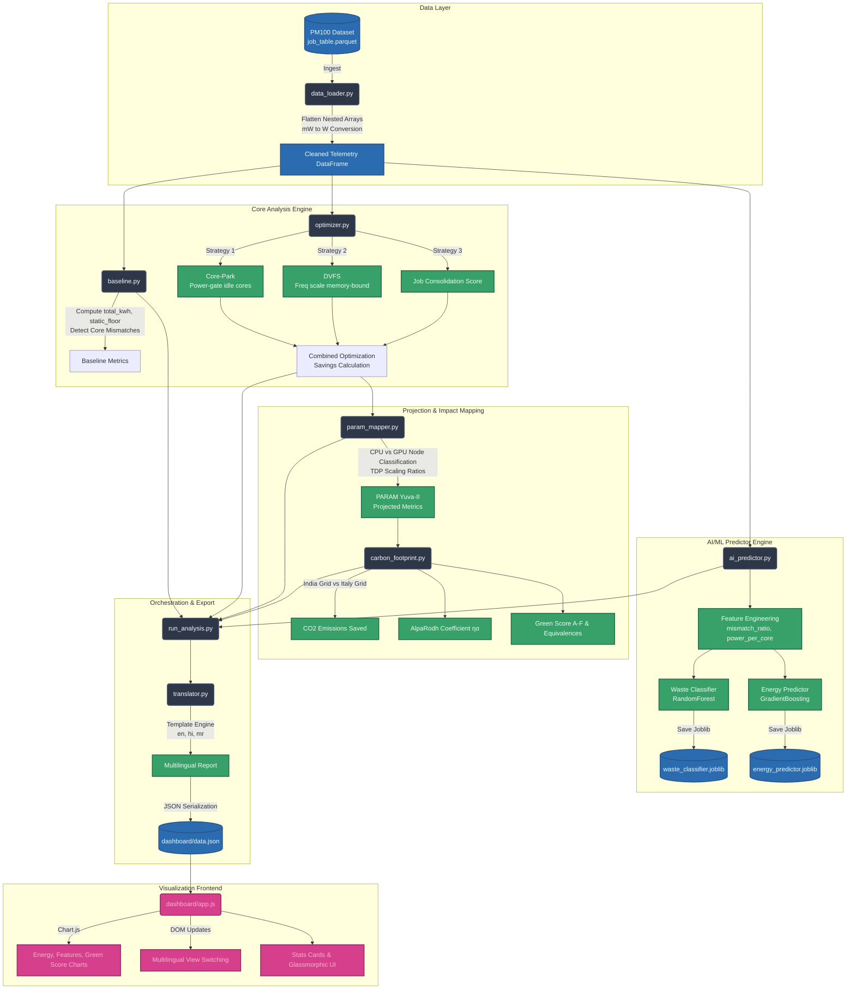

# AlpaRodh System Architecture

This diagram illustrates the precise data flow and module structure of the AlpaRodh framework, strictly based on the implemented codebase.

### Flow Summary:
1. **Data Layer**: Raw telemetry is standardized and cleaned by the `data_loader.py`.
2. **Analysis**: `baseline.py` isolates variable resistance. `optimizer.py` applies three independent physical logic strategies.
3. **AI Pipeline**: Using the cleaned data, `ai_predictor.py` engineers composite features and trains the `scikit-learn` estimators to predict waste beforehand.
4. **Mapping & Carbon**: `param_mapper.py` transposes the Italian hardware TDPs into Indian equivalents. `carbon_footprint.py` computes the localized environmental impact.
5. **UI & Export**: `run_analysis.py` weaves it all together, applies `translator.py` for Layman accessibility, and outputs a strict JSON file that the web frontend consumes natively.
