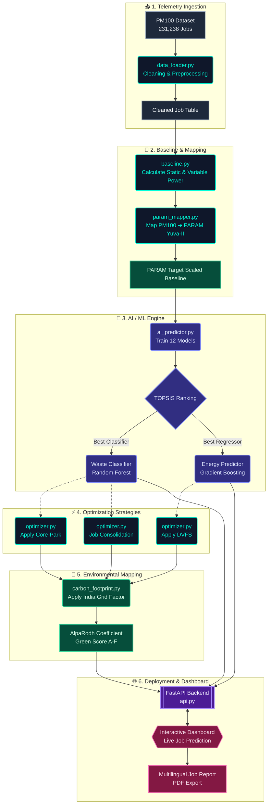

# 🏗️ System Architecture: AlpaRodh

This document outlines the detailed system architecture and data flow of the AlpaRodh framework, specifically targeting the translation of telemetry from the **PM100 (Marconi100)** supercomputer to India's **PARAM Yuva-II** supercomputer.

## 📊 End-to-End Data Flow

The following Mermaid diagram illustrates the complete pipeline — from data ingestion to real-time AI prediction and carbon footprint mapping.

---

## 🧩 Core Modules Explained

### 1. `data_loader.py` & `baseline.py`
The foundation of the pipeline. It ingests historical telemetry, isolating **static resistance** (idle power, fans) from **variable resistance** (dynamic CPU/GPU power draw). AlpaRodh's primary objective is eliminating unnecessary variable resistance caused by over-allocation.

### 2. `ai_predictor.py` & `topsis.py`
Instead of relying on a single algorithm, AlpaRodh trains an ensemble of 6 classifiers and 6 regressors. It then utilizes **TOPSIS (Technique for Order of Preference by Similarity to Ideal Solution)** to mathematically rank the models based on a blend of accuracy, precision, F1-score, and computational overhead.

### 3. `param_mapper.py`
Since AlpaRodh specifically targets CDAC Pune's **PARAM Yuva-II**, this module applies a calculated scaling factor (0.6054) to map the PM100 data to the PARAM architecture, considering differences in total nodes, core counts, and GPU presence.

### 4. `optimizer.py`
The execution arm of the framework, applying three specific hardware-level strategies:
- **Core-Park:** Power-gates unused cores on partially utilized nodes.
- **DVFS (Dynamic Voltage & Frequency Scaling):** Lowers CPU frequency for memory-bound jobs.
- **Consolidation:** Generates a bin-packing score to co-schedule smaller jobs.

### 5. `carbon_footprint.py`
Translates raw kWh savings into tangible environmental metrics. Crucially, it applies the **India Grid Carbon Factor (720 gCO₂/kWh)**, highlighting why saving power in India is >3x more environmentally impactful than saving power on European grids.

### 6. `api.py` & `dashboard/`
The bridge between theoretical analysis and real-world interaction. The FastAPI backend serves the pre-trained ML models, allowing users to enter custom job parameters into the interactive web dashboard and receive instantaneous AI predictions and Green Score certifications.
